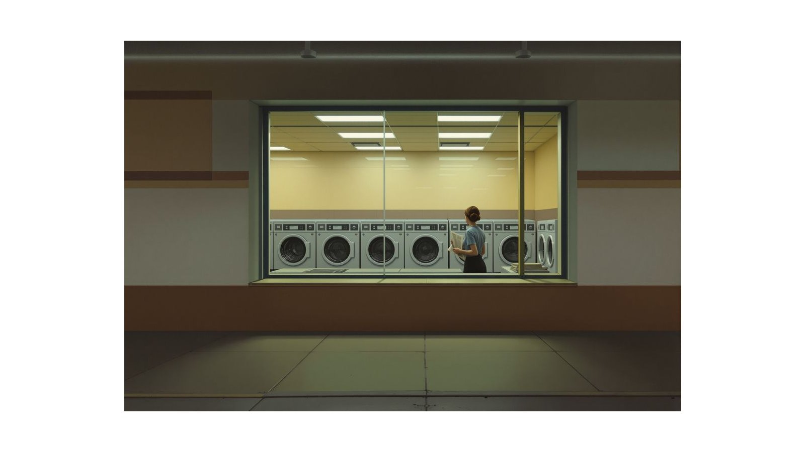
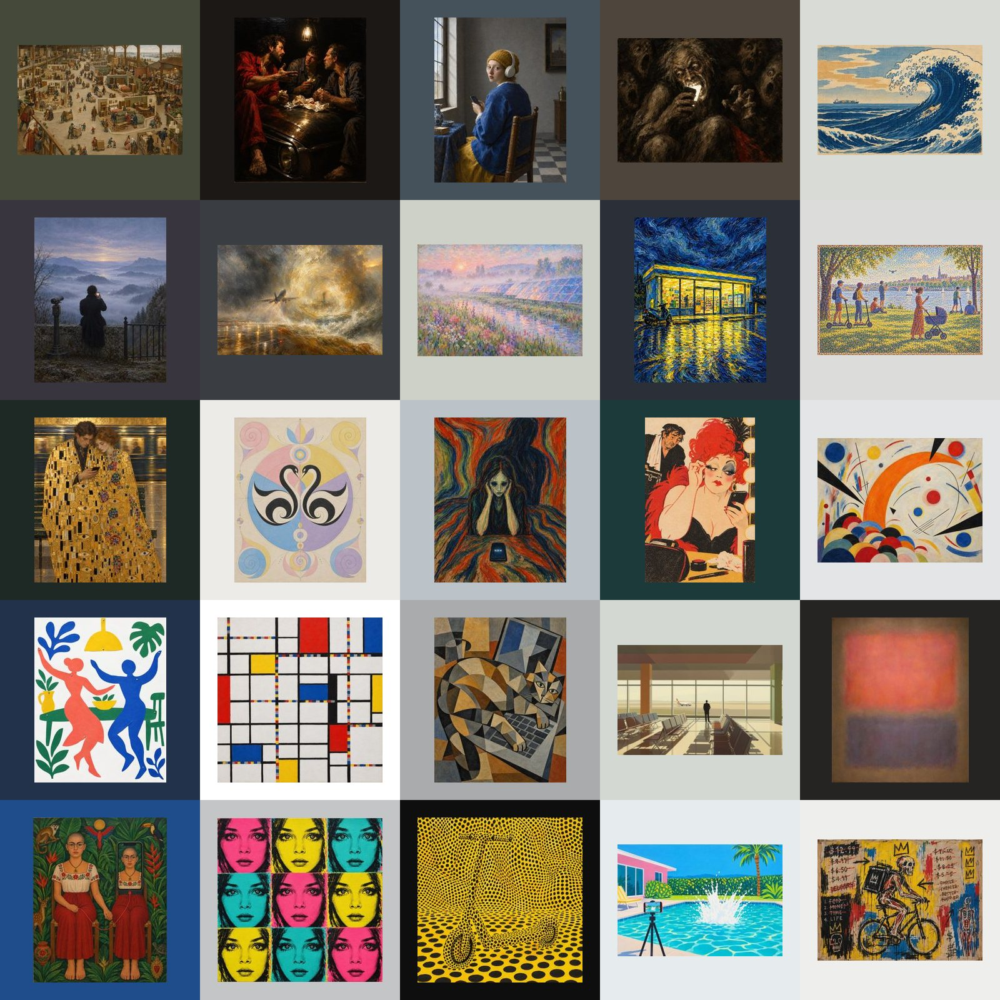
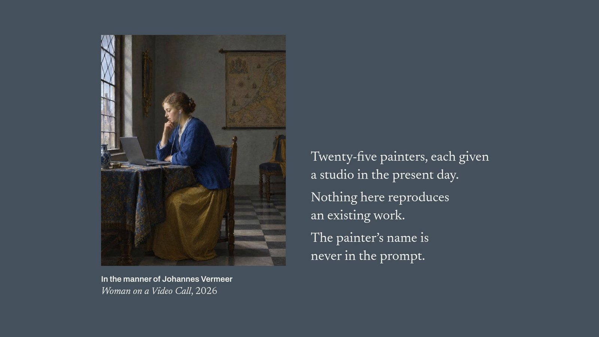

  

<h1 align="center"><em>Pablito</em></h1>

A museum of paintings that were never painted.

<a href="https://stevemcqueenz.github.io/pablito/">Visit the museum</a> · <a href="https://stevemcqueenz.github.io/pablito/film/">Watch the film</a>

 

Twenty-five painters, each given a studio in the present day and asked to paint what they see. Bruegel paints a music festival from a hillside. Vermeer's sitter is on a video call. Goya's crowd is lit by the phones it holds. Hopper's diner is a laundromat at three in the morning, and it is still open.

Nothing here reproduces an existing work. Every painting is a new motif in the manner of its painter, commissioned to a written brief, rendered with an image model, and then chosen, or more often refused, by a curator. One painting in every room moves.

  

## The building

Twenty-five rooms in the order the painters were born, from Bruegel, c. 1525, to Basquiat, 1960. Each room is painted a colour chosen for its paintings. Five works hang in each, whole and at their own proportions, with a museum label beside them: painter, dates, title, medium, dimensions, credit line, accession number. The arrow keys walk you from painting to painting and from room to room.

- **125 works** in 25 rooms, with an extended label for every one.
- **25 moving paintings**, one per room. The still shows first; the clip begins once you have looked for a moment. Downloads are always the still.
- **Wallpapers** for phone, Mac and wide screens, generated at build: the painting hung on its room's wall, nothing written on it.
- **A list of works** with every catalogue entry, and a colophon.

## The film

  

Sixty-nine seconds, silent. The entrance painting coming alive, one wall text, then a walk through nine rooms. Nothing moves but the paintings. [Watch it in the museum](https://stevemcqueenz.github.io/pablito/film/), or open [the film](public/film/pablito.mp4), [the upright cut](public/film/pablito-vertical.mp4) or [the short cut](public/film/pablito-short.mp4) here.

## How a painting is commissioned

The whole museum is one file, `src/data/collection.json`. Each painter has a room title, a wall text, a style brief written in painter's language, a subject rule for the modern twist, and five commissioned subjects. The prompt for any work is its subject, then the style brief, then a line asking for a flat frontal reproduction of a physical painting. Every work's brief is printed on its page in the museum.

The house rules:

1. Never name the painter in a prompt. Describe the hand, the light, the palette and the surface instead.
2. The subject must be something the painter could not have seen in their lifetime.
3. One painting, one idea.
4. No frames, no text, no signatures, no famous compositions. If a result quotes a known painting, the subject is rewritten until it stops.

To run the museum yourself, add a painting, or set one in motion, see [the workshop](docs/workshop.md).

## What this is and is not

Every work is a new commission in the manner of a painter, most of them long out of copyright, made with image and video models from written briefs. No painting by any named artist is reproduced, and the museum is not affiliated with any painter, estate or foundation. The room titles, wall texts and labels are written by the curator. The name on each label says "in the manner of", and means it.
